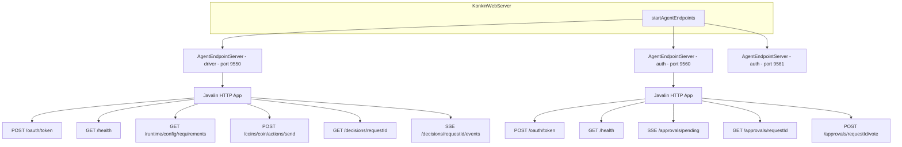
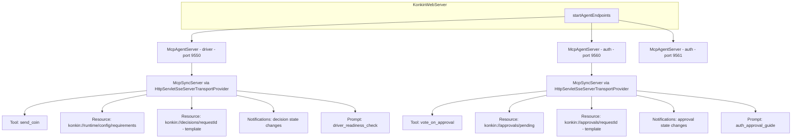
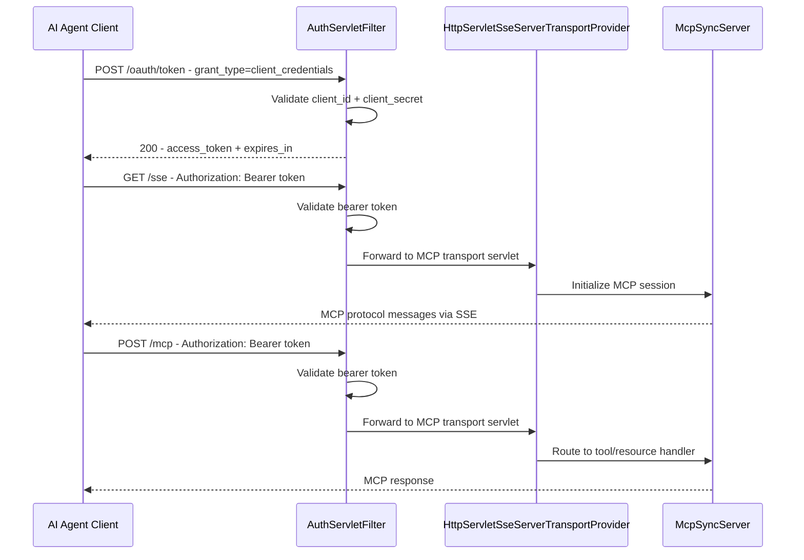

# MCP Agent Endpoint Migration Plan

## Overview

Replace the current Javalin REST-based agent endpoints in `AgentEndpointServer.java` with MCP protocol endpoints using `io.modelcontextprotocol.sdk`. Each agent — one **driver** (primary) and N **auth** (secondary) — gets its own `McpSyncServer` instance bound to its configured port.

---

## Current Architecture



### Key files involved

| File                                         | Role                                                                            |
|----------------------------------------------|---------------------------------------------------------------------------------|
| `AgentEndpointServer.java`                   | 944-line monolith: REST endpoints, SSE streams, auth middleware, business logic |
| `AgentOAuthHandler.java`                     | OAuth2 client_credentials token exchange with rate limiting                     |
| `AgentTokenStore.java`                       | In-memory bearer token store with expiry                                        |
| `McpDataContracts.java`                      | DTOs shared between endpoints and services                                      |
| `PrimaryAgentConfigRequirementsService.java` | Config readiness evaluation logic                                               |
| `KonkinWebServer.java`                       | Wires and lifecycle-manages all agent servers                                   |
| `AgentEndpointIntegrationTest.java`          | 1543-line integration test suite covering all endpoints                         |

---

## Target Architecture



### MCP transport choice

The MCP SDK provides `HttpServletSseServerTransportProvider` which implements `jakarta.servlet.http.HttpServlet`. Since Javalin 6.x runs on Jetty 12+ with Jakarta Servlet support, we have two options:

1. **Standalone Jetty servlet container per agent** — cleanest approach; each agent port runs a minimal Jetty `Server` hosting the MCP servlet. No Javalin dependency for agents.
2. **Mount MCP servlet inside Javalin** — possible via `javalinConfig.jetty.modifyServletContextHandler()`, but couples MCP transport to Javalin internals.

**Decision: Option 1 — Standalone Jetty per agent.** This keeps agent MCP servers fully decoupled from the main web server and aligns with the current architecture where each agent is an independent server on its own port.

---

## Endpoint-to-MCP Mapping

### Driver Agent (primary, type=driver)

| Current REST Endpoint                          | MCP Primitive            | MCP Name                                                             | URI/Description                                                                               |
|------------------------------------------------|--------------------------|----------------------------------------------------------------------|-----------------------------------------------------------------------------------------------|
| `POST /oauth/token`                            | *Transport-level auth*   | —                                                                    | Handled by custom auth filter on the servlet container                                        |
| `GET /health`                                  | Resource                 | `konkin://health`                                                    | Returns agent health status                                                                   |
| `GET /runtime/config/requirements`             | Resource                 | `konkin://runtime/config/requirements`                               | Readiness evaluation; optional `?coin=` becomes URI parameter                                 |
| `GET /runtime/config/requirements?coin={coin}` | Resource Template        | `konkin://runtime/config/requirements/{coin}`                        | Coin-specific readiness                                                                       |
| `POST /coins/{coin}/actions/send`              | Tool                     | `send_coin`                                                          | Input schema: coin, toAddress, amountNative, feePolicy, feeCapNative, memo                    |
| `GET /decisions/{requestId}`                   | Resource Template        | `konkin://decisions/{requestId}`                                     | Decision status lookup                                                                        |
| `SSE /decisions/{requestId}/events`            | Resource + Notifications | `konkin://decisions/{requestId}` + `notifications/resources/updated` | Client subscribes to resource; server sends `notifications/resources/updated` on state change |

### Auth Agent (secondary, type=auth)

| Current REST Endpoint              | MCP Primitive            | MCP Name                                                         | URI/Description                                                         |
|------------------------------------|--------------------------|------------------------------------------------------------------|-------------------------------------------------------------------------|
| `POST /oauth/token`                | *Transport-level auth*   | —                                                                | Handled by custom auth filter                                           |
| `GET /health`                      | Resource                 | `konkin://health`                                                | Returns agent health status                                             |
| `SSE /approvals/pending`           | Resource + Notifications | `konkin://approvals/pending` + `notifications/resources/updated` | List of pending approvals; server pushes resource-changed notifications |
| `GET /approvals/{requestId}`       | Resource Template        | `konkin://approvals/{requestId}`                                 | Approval request details with votes and transitions                     |
| `POST /approvals/{requestId}/vote` | Tool                     | `vote_on_approval`                                               | Input schema: requestId, decision, reason                               |

### Shared Prompts

| Prompt Name              | Agent Type | Purpose                                                        |
|--------------------------|------------|----------------------------------------------------------------|
| `driver_readiness_check` | driver     | Guides agent through readiness → action submission flow        |
| `auth_approval_guide`    | auth       | Guides agent through reviewing and voting on pending approvals |

---

## Authentication Strategy

MCP protocol itself has no built-in authentication. The current OAuth2 `client_credentials` flow must be preserved at the transport level.

### Approach: Servlet Filter wrapping MCP transport



### Implementation

Create `McpAuthServletFilter` that:
1. Intercepts `POST /oauth/token` requests — delegates to existing `AgentOAuthHandler` logic
2. For all other paths, validates `Authorization: Bearer <token>` via existing `AgentTokenStore`
3. Passes authenticated requests through to `HttpServletSseServerTransportProvider`

This preserves the existing auth contract so AI agent clients need minimal changes — they still do OAuth token exchange first, then use bearer tokens.

---

## Notification Strategy (replacing SSE streams)

The current SSE streams (`/decisions/{requestId}/events` and `/approvals/pending`) use polling + heartbeats on dedicated SSE connections. In MCP, the equivalent is:

1. **Resource subscriptions** — MCP clients call `resources/subscribe` for a resource URI
2. **Server notifications** — Server sends `notifications/resources/updated` when the resource changes
3. **Client re-reads** — Client calls `resources/read` to get updated content

### Implementation: Background poller sends resource-changed notifications

The existing `ScheduledExecutorService` heartbeat/poll pattern maps directly:

- **Decision events**: A background task polls `loadDecisionStatus()` per active subscription. On state change, call `mcpSyncServer.notifyResourcesUpdated(new ResourcesUpdatedNotification(uri))`.
- **Pending approvals**: A background task polls `loadAssignedPendingRequests()`. On change, call `mcpSyncServer.notifyResourcesUpdated(...)` for the `konkin://approvals/pending` URI.

The heartbeat mechanism is unnecessary in MCP — the SSE transport handles keep-alive automatically.

---

## Dependency Changes

### Verify or add to pom.xml

The `io.modelcontextprotocol.sdk:mcp:1.0.0` dependency is already present. We need to verify it includes the `HttpServletSseServerTransportProvider` class. If the transport providers are in a separate artifact, add:

```xml
<!-- Only if transport is separate from core -->
<dependency>
    <groupId>io.modelcontextprotocol.sdk</groupId>
    <artifactId>mcp-servlet-sse-server</artifactId>
    <version>${mcp.version}</version>
</dependency>
```

Jetty servlet hosting is already available transitively through Javalin's Jetty dependency.

---

## New File Structure

```
src/main/java/io/konkin/agent/
├── AgentEndpointServer.java          → DELETED (replaced by McpAgentServer)
├── AgentOAuthHandler.java            → KEPT (reused in servlet filter)
├── AgentTokenStore.java              → KEPT (reused in servlet filter)
├── McpAgentServer.java               → NEW  (MCP server lifecycle: create, start, stop)
├── McpAuthServletFilter.java         → NEW  (OAuth + bearer token filter for servlet)
├── mcp/
│   ├── driver/
│   │   ├── SendCoinTool.java         → NEW  (MCP tool: send_coin)
│   │   ├── ConfigRequirementsResource.java → NEW (MCP resource: readiness)
│   │   ├── DecisionStatusResource.java     → NEW (MCP resource: decision lookup)
│   │   ├── DriverReadinessPrompt.java      → NEW (MCP prompt)
│   │   └── DecisionNotificationPoller.java → NEW (background poller for decision state)
│   ├── auth/
│   │   ├── VoteOnApprovalTool.java         → NEW (MCP tool: vote)
│   │   ├── PendingApprovalsResource.java   → NEW (MCP resource: pending list)
│   │   ├── ApprovalDetailsResource.java    → NEW (MCP resource: approval detail)
│   │   ├── AuthApprovalPrompt.java         → NEW (MCP prompt)
│   │   └── ApprovalNotificationPoller.java → NEW (background poller for approval state)
│   └── entity/
│       └── McpDataContracts.java     → KEPT (existing DTOs, may add new ones)
├── primary/
│   ├── PrimaryAgentConfigRequirementsService.java → KEPT (no changes)
│   └── contract/                     → existing empty directory
```

---

## Implementation Chunks

Each chunk is a self-contained unit that compiles and can be tested independently. Proceed in order; checkpoint after each.

### Chunk 1: MCP Transport Scaffold + Health Resource

**Goal:** Create `McpAgentServer` that boots an MCP server on the configured port with a single health resource. Verify it responds to MCP protocol requests.

**Files to create/modify:**
- `McpAgentServer.java` — new class; creates Jetty `Server`, mounts `HttpServletSseServerTransportProvider`, builds `McpSyncServer`
- Register one resource: `konkin://health` returning `{"status": "healthy", "agent": agentName, "type": agentType}`

**Files NOT yet touched:** `KonkinWebServer.java`, tests, auth filter — wiring comes later.

**Acceptance:** MCP client can connect to the port and call `resources/read` for `konkin://health`.

---

### Chunk 2: Authentication Filter

**Goal:** Add `McpAuthServletFilter` that enforces OAuth before MCP transport.

**Files to create/modify:**
- `McpAuthServletFilter.java` — new servlet filter
  - `POST /oauth/token` → reuse logic from `AgentOAuthHandler`
  - All other paths → validate bearer token via `AgentTokenStore`
- `McpAgentServer.java` — register the filter in Jetty before the MCP servlet

**Acceptance:** Unauthenticated MCP requests are rejected with 401. Token exchange works. Authenticated requests reach MCP server.

---

### Chunk 3: Driver Agent — Config Requirements Resource

**Goal:** Implement the readiness resource for the driver agent.

**Files to create/modify:**
- `ConfigRequirementsResource.java` — MCP resource at `konkin://runtime/config/requirements` and resource template at `konkin://runtime/config/requirements/{coin}`
- `McpAgentServer.java` — register resources when `agentType == "driver"`
- `McpDataContracts.java` — no changes needed; reuse existing `RuntimeConfigRequirementsResponse`

**Acceptance:** MCP client reads `konkin://runtime/config/requirements` and gets the same JSON structure as the old REST endpoint.

---

### Chunk 4: Driver Agent — Send Coin Tool

**Goal:** Implement the `send_coin` MCP tool.

**Files to create/modify:**
- `SendCoinTool.java` — MCP tool with input schema `{coin, toAddress, amountNative, feePolicy?, feeCapNative?, memo?}`
  - Migrates all validation and business logic from `handleSendCoinAction()`
  - Returns tool result with `requestId`, `coin`, `action`, `state`
- `McpAgentServer.java` — register tool when `agentType == "driver"`

**Acceptance:** MCP `tools/call` for `send_coin` creates an approval request in the database and returns accepted response.

---

### Chunk 5: Driver Agent — Decision Status Resource + Notifications

**Goal:** Implement decision status lookup and state-change notifications.

**Files to create/modify:**
- `DecisionStatusResource.java` — MCP resource template at `konkin://decisions/{requestId}`
  - Migrates `loadDecisionStatus()` logic
- `DecisionNotificationPoller.java` — background scheduled task that polls active subscriptions and sends `notifications/resources/updated`
- `McpAgentServer.java` — register resource template, start poller, handle subscription tracking

**Acceptance:** MCP client reads decision status. After subscribing, client receives notification when state changes.

---

### Chunk 6: Auth Agent — Vote Tool + Approval Resources

**Goal:** Implement all auth agent MCP primitives.

**Files to create/modify:**
- `VoteOnApprovalTool.java` — MCP tool with input `{requestId, decision, reason?}`
  - Migrates all logic from `handleVote()`
- `ApprovalDetailsResource.java` — MCP resource template at `konkin://approvals/{requestId}`
  - Migrates logic from `handleApprovalDetails()`
- `PendingApprovalsResource.java` — MCP resource at `konkin://approvals/pending`
  - Migrates `loadAssignedPendingRequests()` logic
- `ApprovalNotificationPoller.java` — background poller for pending approvals changes
- `McpAgentServer.java` — register all auth primitives when `agentType == "auth"`

**Acceptance:** MCP auth client can list pending approvals, read details, vote, and receive notifications on changes.

---

### Chunk 7: Prompts

**Goal:** Add guided prompts for both agent types.

**Files to create/modify:**
- `DriverReadinessPrompt.java` — prompt that returns structured instructions for the readiness check → action submission workflow
- `AuthApprovalPrompt.java` — prompt that returns structured instructions for reviewing and voting on approvals
- `McpAgentServer.java` — register prompts per agent type

**Acceptance:** MCP `prompts/get` returns well-structured guidance messages.

---

### Chunk 8: Wire into KonkinWebServer + Remove Old Code

**Goal:** Replace `AgentEndpointServer` with `McpAgentServer` in the application lifecycle.

**Files to modify:**
- `KonkinWebServer.java` — change `startAgentEndpoints()` to create `McpAgentServer` instances instead of `AgentEndpointServer`
- `KonkinWebServer.java` — update `stopAgentEndpoints()` for new server type
- Delete `AgentEndpointServer.java`

**Acceptance:** Application starts with MCP agent servers instead of REST agent servers. All agent functionality works end-to-end.

---

### Chunk 9: Migrate Integration Tests

**Goal:** Update `AgentEndpointIntegrationTest.java` to test MCP endpoints.

**Files to modify:**
- `AgentEndpointIntegrationTest.java` — rewrite HTTP client calls to use MCP client SDK
  - OAuth token exchange tests remain HTTP-level (filter handles it)
  - Tool invocation tests use MCP `tools/call`
  - Resource read tests use MCP `resources/read`
  - SSE stream tests become subscription + notification tests
- May need to add MCP client test dependency

**Acceptance:** All existing test scenarios pass against MCP endpoints. Test count is equal or greater.

---

### Chunk 10: Update Documentation + Clean Up

**Goal:** Final cleanup and documentation updates.

**Files to modify:**
- `documents/SKILL-driver-agent.md` — update endpoint references from REST to MCP protocol
- Remove any dead imports or unused utility methods
- Verify `pom.xml` dependencies are minimal and correct

**Acceptance:** Clean build. All tests pass. Documentation is accurate.

---

## MCP Tool and Resource Specifications

### Tool: `send_coin`

```json
{
  "name": "send_coin",
  "description": "Submit a cryptocurrency send action for approval. Creates an approval request that must be voted on by auth agents before execution.",
  "inputSchema": {
    "type": "object",
    "properties": {
      "coin": { "type": "string", "description": "Coin identifier: bitcoin, testdummycoin" },
      "toAddress": { "type": "string", "description": "Destination wallet address" },
      "amountNative": { "type": "string", "description": "Amount in native coin units" },
      "feePolicy": { "type": "string", "description": "Fee policy: normal, priority, economy" },
      "feeCapNative": { "type": "string", "description": "Maximum fee cap in native units" },
      "memo": { "type": "string", "description": "Optional memo/note for this transaction" }
    },
    "required": ["coin", "toAddress", "amountNative"]
  }
}
```

### Tool: `vote_on_approval`

```json
{
  "name": "vote_on_approval",
  "description": "Cast an approve or deny vote on a pending approval request.",
  "inputSchema": {
    "type": "object",
    "properties": {
      "requestId": { "type": "string", "description": "The approval request ID to vote on" },
      "decision": { "type": "string", "enum": ["approve", "deny"], "description": "Vote decision" },
      "reason": { "type": "string", "description": "Optional reason for the vote" }
    },
    "required": ["requestId", "decision"]
  }
}
```

### Resource: `konkin://runtime/config/requirements`

Returns the full server-level readiness evaluation as JSON. The `RuntimeConfigRequirementsResponse` structure is preserved exactly.

### Resource Template: `konkin://runtime/config/requirements/{coin}`

Returns coin-specific readiness evaluation. Parameter `coin` is the coin identifier.

### Resource Template: `konkin://decisions/{requestId}`

Returns `DecisionStatusResponse` JSON for the given request.

### Resource: `konkin://approvals/pending`

Returns JSON array of pending approval requests assigned to this auth agent.

### Resource Template: `konkin://approvals/{requestId}`

Returns full approval request details including votes, transitions, and execution attempts.

### Resource: `konkin://health`

Returns `{"status": "healthy", "agent": "<name>", "type": "<driver|auth>"}`.

---

## Risk Register

| Risk                                                                                        | Mitigation                                                                               |
|---------------------------------------------------------------------------------------------|------------------------------------------------------------------------------------------|
| MCP SDK v1.0.0 may not include `HttpServletSseServerTransportProvider` in the core artifact | Chunk 1 will validate this immediately; add transport artifact if needed                 |
| AI agent clients need MCP client SDK instead of plain HTTP                                  | The SKILL document and client examples must be updated; MCP clients are widely available |
| SSE polling replacement via MCP notifications may have different latency characteristics    | Keep the 1-second poll interval from the current implementation; tune if needed          |
| Jetty version conflicts between Javalin's Jetty and standalone Jetty for MCP                | Use the same Jetty instance/version; extract from Javalin's transitive dependency        |
| `McpSyncServer` thread safety for concurrent tool calls                                     | The MCP SDK handles concurrency; verify in Chunk 1                                       |
| Integration test rewrite is substantial at 1543 lines                                       | Chunk 9 can be split into sub-chunks: auth tests, driver tests, notification tests       |

---

## Summary of Changes by File

| File                                         | Action                                             | Chunk |
|----------------------------------------------|----------------------------------------------------|-------|
| `pom.xml`                                    | Possibly add MCP transport dependency              | 1     |
| `McpAgentServer.java`                        | CREATE — MCP server lifecycle                      | 1-8   |
| `McpAuthServletFilter.java`                  | CREATE — OAuth + bearer auth                       | 2     |
| `ConfigRequirementsResource.java`            | CREATE — readiness resource                        | 3     |
| `SendCoinTool.java`                          | CREATE — send coin tool                            | 4     |
| `DecisionStatusResource.java`                | CREATE — decision resource                         | 5     |
| `DecisionNotificationPoller.java`            | CREATE — decision notifications                    | 5     |
| `VoteOnApprovalTool.java`                    | CREATE — vote tool                                 | 6     |
| `ApprovalDetailsResource.java`               | CREATE — approval detail resource                  | 6     |
| `PendingApprovalsResource.java`              | CREATE — pending approvals resource                | 6     |
| `ApprovalNotificationPoller.java`            | CREATE — approval notifications                    | 6     |
| `DriverReadinessPrompt.java`                 | CREATE — driver prompt                             | 7     |
| `AuthApprovalPrompt.java`                    | CREATE — auth prompt                               | 7     |
| `KonkinWebServer.java`                       | MODIFY — swap AgentEndpointServer → McpAgentServer | 8     |
| `AgentEndpointServer.java`                   | DELETE                                             | 8     |
| `AgentEndpointIntegrationTest.java`          | REWRITE — MCP client tests                         | 9     |
| `SKILL-driver-agent.md`                      | UPDATE — MCP protocol references                   | 10    |
| `McpDataContracts.java`                      | KEPT — possibly extended                           | 4-6   |
| `AgentOAuthHandler.java`                     | KEPT — reused in filter                            | —     |
| `AgentTokenStore.java`                       | KEPT — reused in filter                            | —     |
| `PrimaryAgentConfigRequirementsService.java` | KEPT — no changes                                  | —     |
